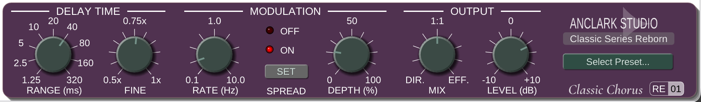

# Classic Chorus RE-01

Classic Chorus RE-01 is a reverse-engineered recreation of the Kjaerhus Classic Chorus audio effect. It provides a **natural vintage character** with a modern, DPI-aware user interface, suitable for guitars, vocals, synths, strings, and other instruments.

This project is open-source and available for free, allowing users to enjoy the classic modulation sound on modern DAWs and operating systems.



## Background

Classic Series was created by Kjaerhus Audio, a Danish company that developed audio plugins. The original plugins were released in the early 2000s and became popular for their musical sound and user-friendly interfaces. However, the products were discontinued in the early 2010s, leaving many users without access to these effects.

Several DAWs and bundled software products included Classic Series plugins, but the original releases were primarily available as 32-bit Windows VST2 plugins. Modern 64-bit-only DAWs and non-Windows users were left out of the fun.

Years later, in 2026, I (AnClark Liu) decided to reverse engineer the Classic Series sound and bring it back to life. Classic Chorus RE-01 is an independent implementation that recreates the behavior of a classic chorus effect in modern plugin formats.

## Features

- Nature, vintage flavor of sound, suitable for a wide range of instruments and vocals.
- Stereo chorus processing based on modulated delay lines.
- Chorus and flanger-style sounds through a wide base-delay range and modulation depth control.
- 2x internal oversampling with anti-aliasing and output de-aliasing filters.
- Optional stereo spread with opposite modulation phase between the channels.
- Separate dry/wet mix and output level controls.
- 16 out-of-box factory presets covering guitars, vocals, strings, synths, bass, and special effects.
- User preset management with save, update, rename, delete, import, and export operations using JSON files.
- Multi-platform support, including Windows, macOS, and Linux.
- Multiple plugin formats, including VST 2.4, VST3, CLAP, LV2.

## Controls

- **Range**: Sets the base delay range from 1.25 ms to 320 ms.
- **Fine**: Applies a fine delay multiplier from 0.5x to 1.0x.
- **Rate**: Sets the modulation LFO rate from 0.1 Hz to 10 Hz.
- **Depth**: Sets the modulation depth from 0% to 100%.
- **Mix**: Crossfades between the dry and processed signals.
- **Level**: Sets the output gain from -10 dB to +10 dB.
- **Spread**: Enables or disables the 180-degree stereo modulation spread.

## How to Compile

To compile Classic Chorus RE-01, you will need to have the following dependencies installed:

- CMake version 3.20 or higher
- A C++ compiler that supports C++20, such as GCC, Clang, or MSVC
- Git, with the DPF submodule checked out

1. Clone the repository:

	```bash
	git clone --recurse-submodules https://github.com/AnClark/ClassicChorus-RE01.git
	cd ClassicChorus-RE01
	```

2. Configure and build the project:

	```bash
	cmake -S . -B build -DCMAKE_BUILD_TYPE=Release
	cmake --build build
	```

3. The compiled plugin files will be located in the `build/bin` directory.

## Build and Package Classic Chorus

Classic Chorus RE-01 uses CMake for building and CPack for packaging. The package format is selected automatically for the target platform:

- Windows and Linux: ZIP archive
- macOS: ProductBuild installer package containing the plugin bundles

To build and package directly with CMake:

```bash
cmake -S . -B build -DCMAKE_BUILD_TYPE=Release
cmake --build build --target package
```

The package is written to the `build` directory. The installed package contains the VST2, VST3, and CLAP plugin bundles, together with the README and license.

## Tools Used

- **Ghidra**: For disassembling and decompiling the original plugin binaries to understand their behavior.
- **DPF**: The DISTRHO Plugin Framework used to provide the cross-platform plugin targets and host integration.
- **Dear ImGui**: The immediate-mode GUI toolkit used by the custom editor.

## Disclaimer

This project is a reverse engineering effort and is not affiliated with Kjaerhus Audio or any of its former employees. The original Classic Series plugins were developed by Kjaerhus Audio, and this implementation is an independent recreation based on their behavior and sound.

This project is not affiliated with Acoustica LLC or other manufacturers that included Classic Series plugins in their products.

The Kjaerhus logo in the plugin UI is used under fair use for non-commercial purposes, to describe where the original Classic Series plugin came from.

## License

This project is licensed under the GPLv3 License. See the [LICENSE](LICENSE) file for details.

Components in `widgets/imgui-ext` and `widgets/imgui-knobs-mod` are licensed under the MIT License, while `widgets/dpf-imgui` is licensed under the ISC License. See the respective LICENSE files in those directories for details.
